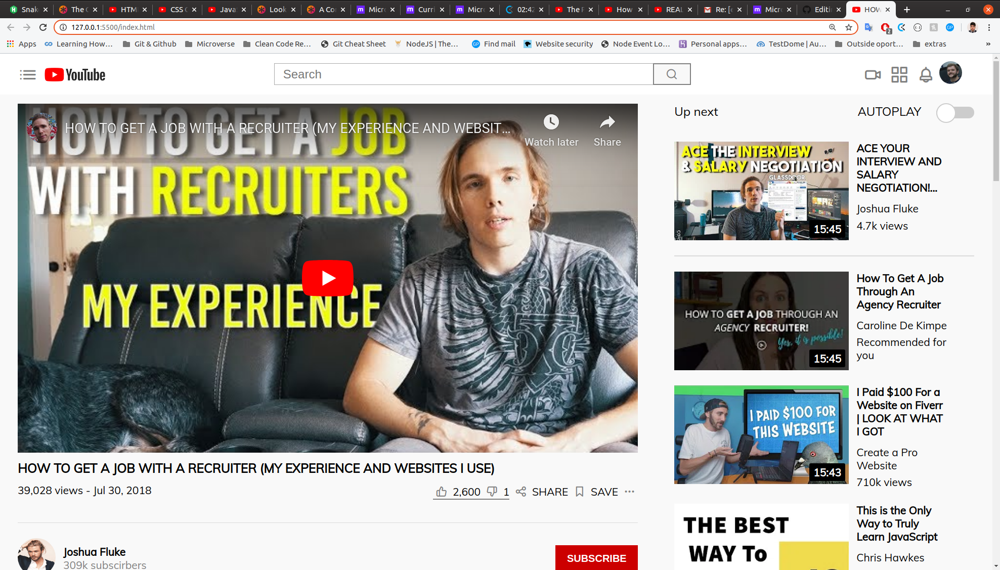

# TubeClone

> This is a Youtube clone, which me and my partner Paul managed to clone using pure HTML and CSS, and we suggested to name it TubeClone.

## Built With

- HTML, CSS,
- Flexbox

## Live Demo

[Live Demo Link](https://elmejdki.github.io/TubeClone/)

## Getting Started

To get a local copy up and running follow these simple example steps.

### Prerequisites
To make this repository working in your local machine you need only a browser.

## Authors

👤 **Zakariae El Mejdki**

- Github: [@elmejdki](https://github.com/elmejdki)
- Twitter: [@ZakariaeElMejdki](https://twitter.com/0ca7848f87ab470)
- Linkedin: [Zakariae El Mejdki](https://www.linkedin.com/in/zakariae-el-mejdki-644898139/)

👤 **Paul Chinweokwu Morah**

- Github: [@chinweokwu](https://github.com/chinweokwu)
- Twitter: [@Morah](https://twitter.com/Morah89820846)
- Linkedin: [Paul Morah](https://www.linkedin.com/in/paul-morah-285b63172/)

## 🤝 Contributing

Contributions, issues and feature requests are welcome!

Feel free to check the [issues page](https://github.com/elmejdki/TubeClone/issues).

## Show your support

Give a ⭐️ if you like this project!

## Acknowledgments

a big hat to me and my partner Paul and anyone who help us either by openning issues on this repository or reviewing our code :)

## 📝 License

This project is [MIT](lic.url) licensed.
